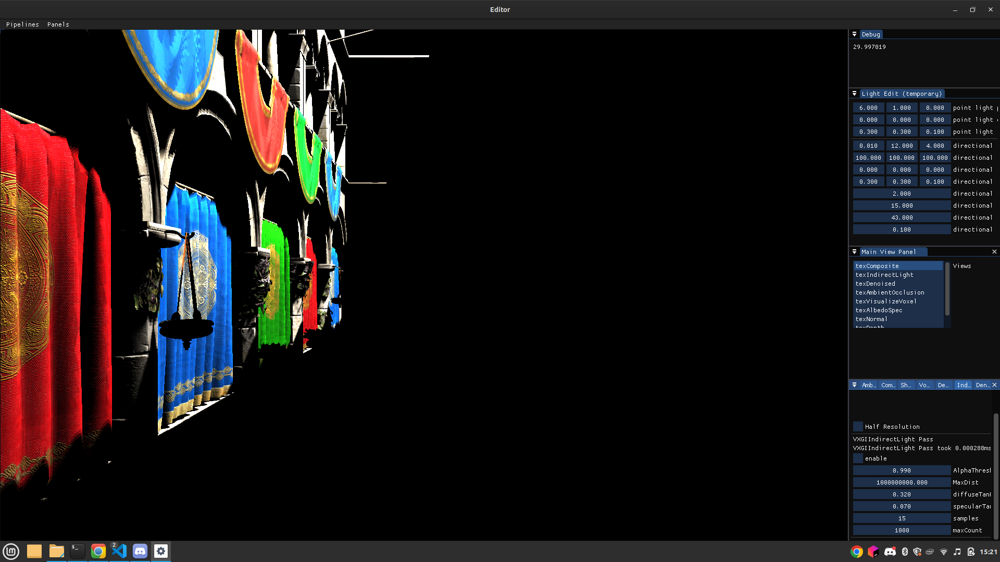
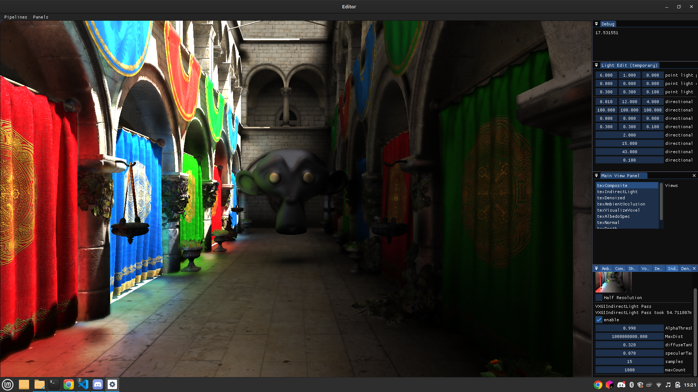
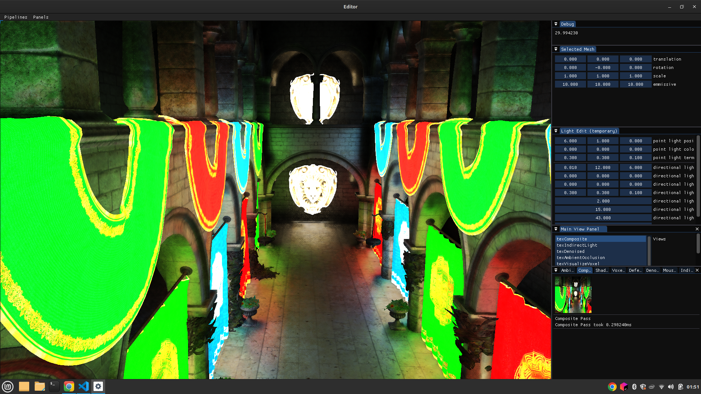

# opengl

special thanks to [@BoyBaykiller](https://github.com/BoyBaykiller)

In this project I explore graphics programming by trying out differect algorithms.
I have currently have VXGI(voxel based Global Illumination also called voxel cone tracing), aTrous denoiser.
I want to add TAA, SVGF denoiser, compute raytracing (path tracing and restir)

## VXGI-Disabled

## VXGI-Enabled

## Suppports Emissive materials
